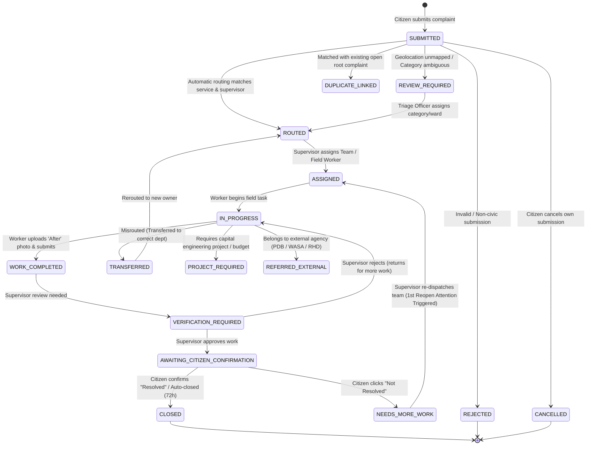

# Complaint State Machine & Lifecycle Specification

> **Document Status:** Authoritative State Machine Specification  
> **Source of Truth:** [docs/MASTER_SPEC.md](file:///C:/laragon/www/amarmayor/docs/MASTER_SPEC.md) (Sections 163–312, 632–635)

---

## 1. State Machine Architecture

The complaint lifecycle is driven by a **centralized, deterministic backend state machine**.
* Normal users perform **human actions** (e.g., *"Start Work"*, *"Upload Evidence"*, *"Verify Resolution"*, *"Problem Still Exists"*), never raw state code edits.
* Internal states preserve fine-grained operational rigor, while citizens are presented with a simplified, reassuring 7-status view.

---

## 2. Internal Status vs Citizen-Facing Status Mapping

| Internal Operational State (`internal_status`) | Citizen Presentation Status (`citizen_status`) | Citizen Bangla Label | Citizen English Label |
|---|---|---|---|
| `submitted` | `received` | অভিযোগ গৃহীত হয়েছে | Complaint Received |
| `review_required` | `received` | অভিযোগ পর্যালোচনা চলছে | Review Underway |
| `routed` | `assigned` | দায়িত্ব অর্পণ করা হয়েছে | Assigned to Department |
| `assigned` | `assigned` | মাঠ পর্যায়ে দায়িত্বপ্রাপ্ত | Field Team Assigned |
| `accepted` | `assigned` | কাজ গ্রহণ করা হয়েছে | Task Accepted |
| `in_progress` | `in_progress` | কাজ চলছে | Work in Progress |
| `work_completed` | `work_completed` | কাজ সম্পন্ন হয়েছে | Work Completed |
| `verification_required` | `work_completed` | যাচাই চলছে | Supervisor Verification |
| `awaiting_citizen_confirmation` | `confirmation_needed` | আপনার মতামত প্রয়োজন | Confirmation Needed |
| `closed` | `resolved` | সমাধান সম্পন্ন | Resolved & Closed |
| `needs_more_work` | `needs_more_work` | পুনরায় কাজ চলছে | Needs More Work |
| `transferred` | `assigned` | সংশ্লিষ্ট বিভাগে স্থানান্তর | Transferred to Department |
| `project_required` | `in_progress` | দীর্ঘমেয়াদী প্রকল্পভুক্ত | Long-Term Project Planned |
| `referred_external` | `in_progress` | সংশ্লিষ্ট সংস্থায় প্রেরিত | Referred to External Agency |
| `duplicate_linked` | `assigned` | পূর্ববর্তী অভিযোগের সাথে সংযুক্ত | Linked to Existing Case |
| `rejected` | `resolved` | গৃহীত হয়নি (কারণ উল্লেখিত) | Rejected (Reason Stated) |
| `cancelled` | `resolved` | অভিযোগ প্রত্যাহারকৃত | Cancelled by Citizen |

---

## 3. Transition Rules, Triggers & Side Effects

| From State | To State | Action Trigger | Authorized Role | Preconditions & Validation | Side Effects & Notifications |
|---|---|---|---|---|---|
| `submitted` | `routed` | `auto_route` | System (Automated) | Valid Category & Ward mapped to active routing rule. | Calculates `deadline_at`, sets `current_supervisor_employee_id`, notifies Supervisor. |
| `submitted` | `review_required` | `route_failed` | System (Automated) | No routing rule match or unmapped Ward boundary. | Adds to Control Room Triage Queue, flags Responsibility Gap. |
| `review_required` | `routed` | `manual_triage` | Control Room / Platform Admin | Category/Ward confirmed by triage officer. | Calculates `deadline_at`, routes to designated Supervisor. |
| `routed` | `assigned` | `assign_team` | Supervisor / Ward Officer | Assigned worker/team exists in same service scope. | Sets `current_team_id`, creates `field_tasks` record, notifies Field Worker. |
| `assigned` | `in_progress` | `start_task` | Field Worker / Team Leader | Worker has active task assignment. | Sets `field_tasks.started_at`, updates `complaints.internal_status = 'in_progress'`. |
| `in_progress` | `work_completed` | `submit_work` | Field Worker / Team Leader | Requires at least 1 valid "After" photo evidence (`task_evidence`). | Sets `field_tasks.completed_at`, increments `completion_attempts`, notifies Supervisor. |
| `work_completed` | `awaiting_citizen_confirmation`| `verify_work` | Supervisor | Supervisor reviews photo evidence and confirms work quality. | Sets `complaints.verified_at`, sends SMS / Push to Citizen with confirmation request. Starts 72h auto-close timer. |
| `work_completed` | `in_progress` | `return_work` | Supervisor | Supervisor finds work incomplete. Notes failure reason. | Resets field task, logs feedback for field worker. |
| `awaiting_citizen_confirmation` | `closed` | `confirm_resolved` | Citizen / System Auto-Close | Citizen clicks "Resolved" OR 72h expires without response. | Sets `closed_at`, creates `citizen_feedback` record, recalculates public ward stats. |
| `awaiting_citizen_confirmation` | `needs_more_work` | `reject_resolution` | Citizen | Citizen clicks "Not Resolved" and selects reason code. | Increments `reopen_count`, triggers **Mayor/Admin Attention Required**, notifies Supervisor. |
| `needs_more_work` | `assigned` | `reassign_team` | Supervisor | Supervisor reviews citizen complaint, re-dispatches crew. | Creates new field task cycle under same complaint. |
| `in_progress` | `transferred` | `transfer_dept` | Supervisor / Dept Head | Valid destination department & transfer reason provided. | Records `complaint_ownership_history`, reroutes to new department supervisor. |

---

## 4. Anti-Gaming Protections

1. **Immutable Case Age:** `submitted_at` is set once upon creation and **never resets** if a complaint is reopened. Case age is strictly calculated from original submission to final closure.
2. **Permanent Deadline History:** If a complaint passes `deadline_at` before resolution, `deadline_missed_at` is permanently recorded. Even if the case is completed later, the SLA breach metric remains on historical records.
3. **Completion Attempt Tracking:** `completion_attempts` increments on every field submission. High completion attempts with recurring reopen flags highlight operational failure.
4. **Mandatory Photo Evidence:** A field worker cannot complete a quick-action task without uploading a verified "After" photograph.
5. **Supervisor Verification Separation:** Field workers cannot verify their own tasks. Verification must be performed by the designated Supervisor.
6. **Immediate Executive Visibility:**
   * **1st Missed Deadline** $\rightarrow$ Triggers `executive_attention (trigger_type='first_deadline_failure')`.
   * **1st Citizen Reopen** $\rightarrow$ Triggers `executive_attention (trigger_type='first_citizen_reopen')`.
   * No multi-level escalation delays; Mayor and Administrator receive immediate dashboard visibility.
