# Database Entity Relationship Diagram (ERD) & Schema Specification

> **Document Status:** Authoritative Database Schema Design  
> **Target Database Engine:** MySQL 8.0+ (InnoDB)  
> **Source of Truth:** [docs/MASTER_SPEC.md](file:///C:/laragon/www/amarmayor/docs/MASTER_SPEC.md) (Sections 544–559, 595–598)

---

## 1. Architectural Principles
1. **Durable Source of Truth:** MySQL 8+ is the sole persistent store for all civic, organizational, governance, audit, and transactional records.
2. **Immutable History & Auditing:** Critical historical records (status transitions, ownership, postings, governance tenures, evidence, audit logs) are append-only.
3. **Effective Dating:** All administrative, organizational, and representative mappings use `effective_from` and `effective_to` timestamps.
4. **Idempotency & Concurrency:** Protected by unique idempotency keys, MySQL row locks / transactions, and composite database constraints.
5. **Privacy by Design:** Citizen PII and sensitive fields are isolated; searchable phone numbers utilize keyed lookup hashes alongside encrypted values.

---

## 2. Mermaid Entity Relationship Overview

```mermaid
erDiagram
    CITIES ||--o{ ZONES : contains
    ZONES ||--o{ WARDS : contains
    WARDS ||--o{ WARD_ZONE_HISTORY : tracks
    RESERVED_SEATS ||--o{ RESERVED_SEAT_WARDS : covers
    WARDS ||--o{ RESERVED_SEAT_WARDS : mapped

    PERSONS ||--o| USERS : "may have login"
    PERSONS ||--o| EMPLOYEES : "profile"
    PERSONS ||--o{ REPRESENTATION_ASSIGNMENTS : holds
    REPRESENTATION_TYPES ||--o{ REPRESENTATION_ASSIGNMENTS : defines
    REPRESENTATION_ASSIGNMENTS ||--o{ REPRESENTATION_AREAS : covers

    DEPARTMENTS ||--o{ SERVICE_UNITS : contains
    DEPARTMENTS ||--o{ OFFICES : operates
    SERVICE_UNITS ||--o{ TEAMS : organizes
    EMPLOYEES ||--o{ TEAM_MEMBERS : assigned
    TEAMS ||--o{ TEAM_MEMBERS : contains
    EMPLOYEES ||--o{ EMPLOYEE_POSTINGS : history
    EMPLOYEES ||--o{ EMPLOYEE_RESPONSIBILITIES : active_scope
    EMPLOYEES ||--o{ EMPLOYEE_SKILLS : possesses

    USERS ||--o{ USER_ROLES : has
    ROLES ||--o{ USER_ROLES : assigned
    ROLES ||--o{ ROLE_PERMISSIONS : defines
    PERMISSIONS ||--o{ ROLE_PERMISSIONS : granted
    USERS ||--o{ USER_SCOPES : restricted_by
    USERS ||--o{ USER_TOKENS : authenticates

    COMPLAINT_CATEGORIES ||--o{ COMPLAINT_SUBCATEGORIES : contains
    COMPLAINT_SUBCATEGORIES ||--o{ ROUTING_RULES : guides
    WARDS ||--o{ ROUTING_RULES : scopes
    COMPLAINT_SUBCATEGORIES ||--o{ SERVICE_DEADLINE_RULES : configures

    USERS ||--o{ COMPLAINTS : submits
    COMPLAINT_SUBCATEGORIES ||--o{ COMPLAINTS : categorizes
    WARDS ||--o{ COMPLAINTS : located_in
    COMPLAINTS ||--o| COMPLAINT_LOCATIONS : has_coordinates
    COMPLAINTS ||--o{ COMPLAINT_MEDIA : attaches_evidence
    COMPLAINTS ||--o{ COMPLAINT_STATUS_HISTORY : transitions
    COMPLAINTS ||--o{ COMPLAINT_OWNERSHIP_HISTORY : assigns
    COMPLAINTS ||--o{ COMPLAINT_SUPPORTERS : affected_citizens
    COMPLAINTS ||--o{ COMPLAINT_MESSAGES : communication
    COMPLAINTS ||--o{ INTERNAL_NOTES : staff_notes
    COMPLAINTS ||--o{ CITIZEN_FEEDBACK : confirms_resolution

    COMPLAINTS ||--o{ FIELD_TASKS : spawns
    TEAMS ||--o{ FIELD_TASKS : assigned_to
    FIELD_TASKS ||--o{ TASK_EVIDENCE : verified_by
    FIELD_TASKS ||--o{ SUPPORT_REQUESTS : requires

    COMPLAINTS ||--o{ EXECUTIVE_ATTENTION : triggers
    EXECUTIVE_ATTENTION ||--o{ EXECUTIVE_DIRECTIVES : issues
    EXECUTIVE_ATTENTION ||--o{ EXPLANATION_REQUESTS : demands
```

---

## 3. Schema Data Dictionary & Table Definitions

### 3.1 Authentication, RBAC & Users

#### `users`
| Column | Type | Nullable | Constraints / Index | Description |
|---|---|---|---|---|
| `id` | BIGINT UNSIGNED | No | PK, Auto Increment | Internal Primary Key |
| `uuid` | CHAR(36) | No | UNIQUE | Public Safe UUID |
| `phone` | VARCHAR(20) | Yes | UNIQUE | Normalized Phone (`+88017XXXXXXXX`) |
| `phone_lookup_hash` | CHAR(64) | Yes | INDEX | HMAC-SHA256 of canonical phone for private lookup |
| `email` | VARCHAR(191) | Yes | UNIQUE | Optional Staff/Admin Email |
| `password_hash` | VARCHAR(255) | Yes | | Argon2id Hash (Null for OTP-only Citizens) |
| `user_type` | ENUM('citizen', 'staff', 'representative', 'admin') | No | INDEX | High-level user classification |
| `status` | ENUM('active', 'inactive', 'suspended', 'pending_verification') | No | Default: 'active', INDEX | Account Status |
| `preferred_language` | ENUM('bn', 'en') | No | Default: 'bn' | Language Preference |
| `mfa_secret` | VARCHAR(255) | Yes | | Encrypted TOTP Secret for Privileged Roles |
| `mfa_enabled_at` | DATETIME | Yes | | Timestamp when MFA was enabled |
| `last_login_at` | DATETIME | Yes | | Last successful login |
| `created_at` | DATETIME | No | Default: CURRENT_TIMESTAMP | Record creation timestamp |
| `updated_at` | DATETIME | No | Default: CURRENT_TIMESTAMP ON UPDATE | Last update timestamp |

#### `roles`
| Column | Type | Nullable | Constraints / Index | Description |
|---|---|---|---|---|
| `id` | INT UNSIGNED | No | PK, Auto Increment | Primary Key |
| `slug` | VARCHAR(64) | No | UNIQUE | Machine-readable role code (`mayor`, `supervisor`, `field_worker`) |
| `name_bn` | VARCHAR(128) | No | | Bangla display name |
| `name_en` | VARCHAR(128) | No | | English display name |
| `is_system` | TINYINT(1) | No | Default: 1 | Prevents deletion of core system roles |
| `created_at` | DATETIME | No | Default: CURRENT_TIMESTAMP | Creation timestamp |

#### `permissions`
| Column | Type | Nullable | Constraints / Index | Description |
|---|---|---|---|---|
| `id` | INT UNSIGNED | No | PK, Auto Increment | Primary Key |
| `slug` | VARCHAR(100) | No | UNIQUE | Permission string (`complaint.verify`, `executive.directive.issue`) |
| `category` | VARCHAR(64) | No | INDEX | Functional group (`complaint`, `workforce`, `governance`, `system`) |
| `description` | VARCHAR(255) | Yes | | Human-readable explanation of capability |

#### `role_permissions`
| Column | Type | Nullable | Constraints / Index | Description |
|---|---|---|---|---|
| `role_id` | INT UNSIGNED | No | FK $\rightarrow$ `roles.id` ON DELETE CASCADE | Role ID |
| `permission_id` | INT UNSIGNED | No | FK $\rightarrow$ `permissions.id` ON DELETE CASCADE | Permission ID |
| PRIMARY KEY (`role_id`, `permission_id`) | | | | Composite PK |

#### `user_roles`
| Column | Type | Nullable | Constraints / Index | Description |
|---|---|---|---|---|
| `user_id` | BIGINT UNSIGNED | No | FK $\rightarrow$ `users.id` ON DELETE CASCADE | User ID |
| `role_id` | INT UNSIGNED | No | FK $\rightarrow$ `roles.id` ON DELETE CASCADE | Role ID |
| PRIMARY KEY (`user_id`, `role_id`) | | | | Composite PK |

#### `user_scopes`
| Column | Type | Nullable | Constraints / Index | Description |
|---|---|---|---|---|
| `id` | BIGINT UNSIGNED | No | PK, Auto Increment | Primary Key |
| `user_id` | BIGINT UNSIGNED | No | FK $\rightarrow$ `users.id` ON DELETE CASCADE, INDEX | User ID |
| `scope_type` | ENUM('citywide', 'zone', 'ward', 'department', 'service_unit', 'team', 'self') | No | INDEX | Scope hierarchy level |
| `scope_id` | BIGINT UNSIGNED | Yes | INDEX | ID of target entity (Zone ID, Ward ID, Dept ID, etc.) |
| `effective_from` | DATETIME | No | INDEX | Valid start timestamp |
| `effective_to` | DATETIME | Yes | INDEX | Valid end timestamp (Null = Indefinite) |
| INDEX (`user_id`, `scope_type`, `scope_id`, `effective_from`, `effective_to`) | | | | Composite query index |

#### `user_tokens`
| Column | Type | Nullable | Constraints / Index | Description |
|---|---|---|---|---|
| `id` | BIGINT UNSIGNED | No | PK, Auto Increment | Primary Key |
| `user_id` | BIGINT UNSIGNED | No | FK $\rightarrow$ `users.id` ON DELETE CASCADE | User ID |
| `token_hash` | CHAR(64) | No | UNIQUE | SHA-256 hash of random bearer token |
| `device_name` | VARCHAR(128) | Yes | | Mobile/Client device identifier |
| `device_id` | VARCHAR(128) | Yes | INDEX | Unique hardware / installation ID |
| `ip_address` | VARCHAR(45) | Yes | | Last IP address |
| `user_agent` | VARCHAR(255) | Yes | | Client User Agent |
| `expires_at` | DATETIME | No | INDEX | Expiration timestamp |
| `revoked_at` | DATETIME | Yes | INDEX | Revocation timestamp |
| `created_at` | DATETIME | No | Default: CURRENT_TIMESTAMP | |

---

### 3.2 Geographic & Municipal Hierarchy

#### `cities`
| Column | Type | Nullable | Constraints / Index | Description |
|---|---|---|---|---|
| `id` | INT UNSIGNED | No | PK, Auto Increment | Primary Key |
| `slug` | VARCHAR(64) | No | UNIQUE | `mcc` (Mymensingh City Corporation) |
| `name_bn` | VARCHAR(128) | No | | ময়মনসিংহ সিটি কর্পোরেশন |
| `name_en` | VARCHAR(128) | No | | Mymensingh City Corporation |
| `short_name_bn` | VARCHAR(32) | No | | মসিক |
| `short_name_en` | VARCHAR(32) | No | | MCC |
| `logo_url` | VARCHAR(255) | Yes | | Official Logo |
| `official_address_bn`| TEXT | Yes | | Official Office Address (Bangla) |
| `official_address_en`| TEXT | Yes | | Official Office Address (English) |
| `official_phone` | VARCHAR(32) | Yes | | Public Service Hotline |
| `official_email` | VARCHAR(128) | Yes | | Official Email |
| `website` | VARCHAR(128) | Yes | | Official Website |
| `service_hours` | VARCHAR(128) | Yes | | Standard Office Hours |
| `timezone` | VARCHAR(64) | No | Default: 'Asia/Dhaka' | Application Timezone |

#### `zones`
| Column | Type | Nullable | Constraints / Index | Description |
|---|---|---|---|---|
| `id` | INT UNSIGNED | No | PK, Auto Increment | Primary Key |
| `city_id` | INT UNSIGNED | No | FK $\rightarrow$ `cities.id` | City Reference |
| `zone_number` | INT UNSIGNED | No | UNIQUE (`city_id`, `zone_number`) | Zone 1, 2, 3 |
| `name_bn` | VARCHAR(128) | No | | অঞ্চল ১ |
| `name_en` | VARCHAR(128) | No | | Zone 1 |
| `office_address` | TEXT | Yes | | Zone Office Address |
| `official_phone` | VARCHAR(32) | Yes | | Zone Contact Phone |
| `official_email` | VARCHAR(128) | Yes | | Zone Contact Email |
| `status` | ENUM('active', 'inactive') | No | Default: 'active' | Status |

#### `wards`
| Column | Type | Nullable | Constraints / Index | Description |
|---|---|---|---|---|
| `id` | INT UNSIGNED | No | PK, Auto Increment | Primary Key |
| `city_id` | INT UNSIGNED | No | FK $\rightarrow$ `cities.id` | City Reference |
| `zone_id` | INT UNSIGNED | No | FK $\rightarrow$ `zones.id`, INDEX | Current Zone Mapping |
| `ward_number` | INT UNSIGNED | No | UNIQUE (`city_id`, `ward_number`) | Ward 1 – 33+ |
| `name_bn` | VARCHAR(128) | No | | ওয়ার্ড ০১ |
| `name_en` | VARCHAR(128) | No | | Ward 01 |
| `area_names_bn` | TEXT | Yes | | Prominent areas / mahallas in Bangla |
| `area_names_en` | TEXT | Yes | | Prominent areas / mahallas in English |
| `approximate_area_sqkm` | DECIMAL(8,3) | Yes | | Area in square kilometers |
| `verified_population` | INT UNSIGNED | Yes | | Verified Population count |
| `household_count` | INT UNSIGNED | Yes | | Verified Household count |
| `office_address` | TEXT | Yes | | Ward Councillor / Inspector Office Address |
| `official_contact` | VARCHAR(64) | Yes | | Ward Office Phone |
| `boundary_geojson` | LONGTEXT | Yes | | Verified GeoJSON Polygon (Null if unmapped) |
| `status` | ENUM('active', 'inactive') | No | Default: 'active' | Operational Status |

#### `ward_zone_history`
| Column | Type | Nullable | Constraints / Index | Description |
|---|---|---|---|---|
| `id` | BIGINT UNSIGNED | No | PK, Auto Increment | Primary Key |
| `ward_id` | INT UNSIGNED | No | FK $\rightarrow$ `wards.id`, INDEX | Ward ID |
| `zone_id` | INT UNSIGNED | No | FK $\rightarrow$ `zones.id`, INDEX | Zone ID |
| `effective_from` | DATETIME | No | INDEX | Start of mapping |
| `effective_to` | DATETIME | Yes | INDEX | End of mapping |
| `authority_order` | VARCHAR(128) | Yes | | Government Gazette / Resolution Reference |
| `changed_by_user_id`| BIGINT UNSIGNED| No | FK $\rightarrow$ `users.id` | Admin who made the update |
| `created_at` | DATETIME | No | Default: CURRENT_TIMESTAMP | Audit timestamp |

---

### 3.3 Governance & Representation Model

#### `representation_types`
| Column | Type | Nullable | Constraints / Index | Description |
|---|---|---|---|---|
| `id` | INT UNSIGNED | No | PK, Auto Increment | Primary Key |
| `slug` | VARCHAR(64) | No | UNIQUE | `mayor`, `administrator`, `general_councillor`, `reserved_women_councillor`, `responsible_officer` |
| `name_bn` | VARCHAR(128) | No | | পদবি (বাংলা) |
| `name_en` | VARCHAR(128) | No | | Designation (English) |
| `is_electoral` | TINYINT(1) | No | Default: 0 | 1 for Mayor/Councillors, 0 for Appointed Officers |

#### `reserved_seats`
| Column | Type | Nullable | Constraints / Index | Description |
|---|---|---|---|---|
| `id` | INT UNSIGNED | No | PK, Auto Increment | Primary Key |
| `city_id` | INT UNSIGNED | No | FK $\rightarrow$ `cities.id` | City Reference |
| `seat_number` | INT UNSIGNED | No | UNIQUE (`city_id`, `seat_number`) | Reserved Seat 1–11 |
| `name_bn` | VARCHAR(128) | No | | সংরক্ষিত আসন ০১ |
| `name_en` | VARCHAR(128) | No | | Reserved Seat 01 |
| `status` | ENUM('active', 'inactive') | No | Default: 'active' | Operational status |

#### `reserved_seat_wards`
| Column | Type | Nullable | Constraints / Index | Description |
|---|---|---|---|---|
| `id` | INT UNSIGNED | No | PK, Auto Increment | Primary Key |
| `reserved_seat_id`| INT UNSIGNED | No | FK $\rightarrow$ `reserved_seats.id`, INDEX | Reserved Seat Reference |
| `ward_id` | INT UNSIGNED | No | FK $\rightarrow$ `wards.id`, INDEX | General Ward Reference |
| `effective_from` | DATETIME | No | | Valid mapping start |
| `effective_to` | DATETIME | Yes | | Valid mapping end |
| UNIQUE (`reserved_seat_id`, `ward_id`, `effective_from`) | | | | Composite uniqueness |

#### `persons`
| Column | Type | Nullable | Constraints / Index | Description |
|---|---|---|---|---|
| `id` | BIGINT UNSIGNED | No | PK, Auto Increment | Primary Key |
| `user_id` | BIGINT UNSIGNED | Yes | FK $\rightarrow$ `users.id`, UNIQUE | Linked Login Account (Nullable if non-login) |
| `full_name_bn` | VARCHAR(128) | No | | পূর্ণ নাম (বাংলা) |
| `full_name_en` | VARCHAR(128) | No | | Full Name (English) |
| `photo_url` | VARCHAR(255) | Yes | | Official Photo Path |
| `official_phone` | VARCHAR(32) | Yes | | Official Contact Number |
| `official_email` | VARCHAR(128) | Yes | | Official Email |
| `is_public_visible` | TINYINT(1) | No | Default: 1 | Public Directory Flag |
| `created_at` | DATETIME | No | Default: CURRENT_TIMESTAMP | |
| `updated_at` | DATETIME | No | Default: CURRENT_TIMESTAMP ON UPDATE | |

#### `representation_assignments`
| Column | Type | Nullable | Constraints / Index | Description |
|---|---|---|---|---|
| `id` | BIGINT UNSIGNED | No | PK, Auto Increment | Primary Key |
| `person_id` | BIGINT UNSIGNED | No | FK $\rightarrow$ `persons.id`, INDEX | Person |
| `representation_type_id` | INT UNSIGNED | No | FK $\rightarrow$ `representation_types.id`, INDEX | Type (Mayor / Councillor / Resp Officer) |
| `authority_basis` | ENUM('elected', 'appointed', 'acting', 'temporary', 'ex_officio') | No | INDEX | Basis of Authority |
| `official_order_no`| VARCHAR(128) | Yes | | Gazette / Ministry Order Ref |
| `order_document_url`| VARCHAR(255) | Yes | | Uploaded Scanned Order |
| `effective_from` | DATETIME | No | INDEX | Start of tenure |
| `effective_to` | DATETIME | Yes | INDEX | End of tenure (Null = Current) |
| `status` | ENUM('active', 'inactive', 'term_ended', 'suspended', 'vacant') | No | Default: 'active', INDEX | Status |
| `created_by_user_id` | BIGINT UNSIGNED | No | FK $\rightarrow$ `users.id` | Admin who created assignment |
| `created_at` | DATETIME | No | Default: CURRENT_TIMESTAMP | |

#### `representation_areas`
| Column | Type | Nullable | Constraints / Index | Description |
|---|---|---|---|---|
| `id` | BIGINT UNSIGNED | No | PK, Auto Increment | Primary Key |
| `representation_assignment_id` | BIGINT UNSIGNED | No | FK $\rightarrow$ `representation_assignments.id` ON DELETE CASCADE, INDEX | Assignment Reference |
| `area_type` | ENUM('citywide', 'reserved_seat', 'ward') | No | INDEX | Coverage scope type |
| `area_id` | BIGINT UNSIGNED | Yes | INDEX | Ward ID or Reserved Seat ID (Null for citywide) |

---

### 3.4 Organizational Structure & Workforce Directory

#### `departments`
| Column | Type | Nullable | Constraints / Index | Description |
|---|---|---|---|---|
| `id` | INT UNSIGNED | No | PK, Auto Increment | Primary Key |
| `city_id` | INT UNSIGNED | No | FK $\rightarrow$ `cities.id` | City Reference |
| `slug` | VARCHAR(64) | No | UNIQUE (`city_id`, `slug`) | `waste_management`, `health`, `engineering` |
| `name_bn` | VARCHAR(128) | No | | বর্জ্য ব্যবস্থাপনা বিভাগ |
| `name_en` | VARCHAR(128) | No | | Waste Management Department |
| `description_bn` | TEXT | Yes | | Public Service Overview (Bangla) |
| `description_en` | TEXT | Yes | | Public Service Overview (English) |
| `official_phone` | VARCHAR(32) | Yes | | Department Public Hotline |
| `official_email` | VARCHAR(128) | Yes | | Department Email |
| `status` | ENUM('active', 'inactive') | No | Default: 'active' | Operational status |

#### `service_units`
| Column | Type | Nullable | Constraints / Index | Description |
|---|---|---|---|---|
| `id` | INT UNSIGNED | No | PK, Auto Increment | Primary Key |
| `department_id` | INT UNSIGNED | No | FK $\rightarrow$ `departments.id`, INDEX | Department Reference |
| `slug` | VARCHAR(64) | No | UNIQUE (`department_id`, `slug`) | `mosquito_control`, `drain_cleaning`, `street_lights` |
| `name_bn` | VARCHAR(128) | No | | মশক নিধন শাখা |
| `name_en` | VARCHAR(128) | No | | Mosquito Control Unit |
| `status` | ENUM('active', 'inactive') | No | Default: 'active' | Status |

#### `offices`
| Column | Type | Nullable | Constraints / Index | Description |
|---|---|---|---|---|
| `id` | INT UNSIGNED | No | PK, Auto Increment | Primary Key |
| `city_id` | INT UNSIGNED | No | FK $\rightarrow$ `cities.id` | City Reference |
| `office_type` | ENUM('head_office', 'zone_office', 'ward_office', 'department_office', 'service_center') | No | INDEX | Office Type |
| `zone_id` | INT UNSIGNED | Yes | FK $\rightarrow$ `zones.id` | Optional Zone Mapping |
| `ward_id` | INT UNSIGNED | Yes | FK $\rightarrow$ `wards.id` | Optional Ward Mapping |
| `department_id` | INT UNSIGNED | Yes | FK $\rightarrow$ `departments.id` | Optional Department Mapping |
| `name_bn` | VARCHAR(128) | No | | অফিসের নাম (বাংলা) |
| `name_en` | VARCHAR(128) | No | | Office Name (English) |
| `address` | TEXT | Yes | | Physical Location Address |
| `official_phone` | VARCHAR(32) | Yes | | Contact Phone |
| `official_email` | VARCHAR(128) | Yes | | Contact Email |
| `office_hours` | VARCHAR(128) | Yes | | Working hours |
| `is_public_visible` | TINYINT(1) | No | Default: 1 | Visible in public directory |

#### `employees`
| Column | Type | Nullable | Constraints / Index | Description |
|---|---|---|---|---|
| `id` | BIGINT UNSIGNED | No | PK, Auto Increment | Primary Key |
| `person_id` | BIGINT UNSIGNED | No | FK $\rightarrow$ `persons.id`, UNIQUE | Person Reference |
| `employee_code` | VARCHAR(32) | No | UNIQUE | Safe ID e.g. `MCC-EMP-000421` |
| `official_service_no`| VARCHAR(64) | Yes | INDEX | Government Service / Payroll Code |
| `employment_type` | ENUM('officer', 'permanent', 'temporary', 'daily_wage', 'outsourced', 'cleaner', 'field_worker', 'driver', 'supervisor', 'inspector', 'technician', 'other') | No | INDEX | Employment Classification |
| `designation_bn` | VARCHAR(128) | No | | পদবি (বাংলা) |
| `designation_en` | VARCHAR(128) | No | | Designation (English) |
| `joining_date` | DATE | Yes | | Official Joining Date |
| `duty_status` | ENUM('available', 'on_duty', 'busy', 'on_leave', 'off_duty', 'temporarily_reassigned', 'inactive') | No | Default: 'available', INDEX | Operational Availability |
| `reports_to_employee_id` | BIGINT UNSIGNED | Yes | FK $\rightarrow$ `employees.id`, INDEX | Direct Supervisor / Reporting Officer |
| `created_at` | DATETIME | No | Default: CURRENT_TIMESTAMP | |
| `updated_at` | DATETIME | No | Default: CURRENT_TIMESTAMP ON UPDATE | |

#### `employee_postings`
| Column | Type | Nullable | Constraints / Index | Description |
|---|---|---|---|---|
| `id` | BIGINT UNSIGNED | No | PK, Auto Increment | Primary Key |
| `employee_id` | BIGINT UNSIGNED | No | FK $\rightarrow$ `employees.id`, INDEX | Employee Reference |
| `department_id` | INT UNSIGNED | No | FK $\rightarrow$ `departments.id`, INDEX | Department Reference |
| `service_unit_id` | INT UNSIGNED | Yes | FK $\rightarrow$ `service_units.id` | Service Unit Reference |
| `office_id` | INT UNSIGNED | Yes | FK $\rightarrow$ `offices.id` | Base Office Location |
| `posting_type` | ENUM('regular', 'temporary', 'acting', 'special_duty', 'emergency') | No | Default: 'regular', INDEX | Posting Nature |
| `effective_from` | DATETIME | No | INDEX | Posting Start Timestamp |
| `effective_to` | DATETIME | Yes | INDEX | Posting End Timestamp (Null = Current) |
| `transfer_order_ref`| VARCHAR(128) | Yes | | Official Office Order Reference |
| `transfer_reason` | TEXT | Yes | | Reason for transfer/posting |
| `authorized_by_user_id`| BIGINT UNSIGNED| No | FK $\rightarrow$ `users.id` | Authorizing Administrator |
| `created_at` | DATETIME | No | Default: CURRENT_TIMESTAMP | Audit timestamp |

#### `employee_responsibilities`
| Column | Type | Nullable | Constraints / Index | Description |
|---|---|---|---|---|
| `id` | BIGINT UNSIGNED | No | PK, Auto Increment | Primary Key |
| `employee_id` | BIGINT UNSIGNED | No | FK $\rightarrow$ `employees.id`, INDEX | Employee Reference |
| `area_type` | ENUM('citywide', 'zone', 'ward', 'special') | No | INDEX | Geographic Responsibility Level |
| `area_id` | BIGINT UNSIGNED | Yes | INDEX | Zone ID or Ward ID |
| `service_unit_id` | INT UNSIGNED | Yes | FK $\rightarrow$ `service_units.id`, INDEX | Specific Functional Area |
| `effective_from` | DATETIME | No | INDEX | Start Timestamp |
| `effective_to` | DATETIME | Yes | INDEX | End Timestamp (Null = Current) |

#### `employee_skills`
| Column | Type | Nullable | Constraints / Index | Description |
|---|---|---|---|---|
| `id` | BIGINT UNSIGNED | No | PK, Auto Increment | Primary Key |
| `employee_id` | BIGINT UNSIGNED | No | FK $\rightarrow$ `employees.id`, INDEX | Employee Reference |
| `skill_slug` | VARCHAR(64) | No | INDEX | `waste_collection`, `drain_cleaning`, `fogging`, `electrical_repair`, `plumbing`, `driving`, `heavy_equipment` |
| UNIQUE (`employee_id`, `skill_slug`) | | | | Composite Unique |

#### `teams`
| Column | Type | Nullable | Constraints / Index | Description |
|---|---|---|---|---|
| `id` | INT UNSIGNED | No | PK, Auto Increment | Primary Key |
| `department_id` | INT UNSIGNED | No | FK $\rightarrow$ `departments.id`, INDEX | Department |
| `service_unit_id` | INT UNSIGNED | Yes | FK $\rightarrow$ `service_units.id`, INDEX | Service Unit |
| `zone_id` | INT UNSIGNED | Yes | FK $\rightarrow$ `zones.id` | Base Zone |
| `ward_id` | INT UNSIGNED | Yes | FK $\rightarrow$ `wards.id`, INDEX | Primary Assigned Ward |
| `name_bn` | VARCHAR(128) | No | | দল ১৯-ক (বর্জ্য অপসারণ) |
| `name_en` | VARCHAR(128) | No | | Team 19-A (Waste) |
| `supervisor_employee_id`| BIGINT UNSIGNED| Yes | FK $\rightarrow$ `employees.id`, INDEX | Operational Supervisor |
| `team_leader_employee_id`| BIGINT UNSIGNED| Yes | FK $\rightarrow$ `employees.id` | Field Team Leader |
| `status` | ENUM('active', 'inactive') | No | Default: 'active' | Operational status |

#### `team_members`
| Column | Type | Nullable | Constraints / Index | Description |
|---|---|---|---|---|
| `id` | BIGINT UNSIGNED | No | PK, Auto Increment | Primary Key |
| `team_id` | INT UNSIGNED | No | FK $\rightarrow$ `teams.id`, INDEX | Team Reference |
| `employee_id` | BIGINT UNSIGNED | No | FK $\rightarrow$ `employees.id`, INDEX | Employee Reference |
| `effective_from` | DATETIME | No | INDEX | Membership start |
| `effective_to` | DATETIME | Yes | INDEX | Membership end (Null = Current) |
| UNIQUE (`team_id`, `employee_id`, `effective_from`) | | | | Composite Unique |

---

### 3.5 Complaint Taxonomy, SLA & Routing Rules

#### `complaint_categories`
| Column | Type | Nullable | Constraints / Index | Description |
|---|---|---|---|---|
| `id` | INT UNSIGNED | No | PK, Auto Increment | Primary Key |
| `slug` | VARCHAR(64) | No | UNIQUE | `cleanliness`, `mosquito`, `drainage`, `roads`, `street_lighting`, `water_supply`, `encroachment`, `public_assets`, `environment`, `civic_services`, `urgent_hazard`, `other` |
| `name_bn` | VARCHAR(128) | No | | পরিচ্ছন্নতা ও বর্জ্য |
| `name_en` | VARCHAR(128) | No | | Cleanliness & Waste |
| `icon_name` | VARCHAR(64) | Yes | | Bootstrap Icon Name (`trash`, `bug`, `water`) |
| `display_order` | INT UNSIGNED | No | Default: 0 | UI Sort Order |
| `is_active` | TINYINT(1) | No | Default: 1 | Active Flag |

#### `complaint_subcategories`
| Column | Type | Nullable | Constraints / Index | Description |
|---|---|---|---|---|
| `id` | INT UNSIGNED | No | PK, Auto Increment | Primary Key |
| `category_id` | INT UNSIGNED | No | FK $\rightarrow$ `complaint_categories.id`, INDEX | Parent Category Reference |
| `slug` | VARCHAR(64) | No | UNIQUE (`category_id`, `slug`) | Machine identifier |
| `name_bn` | VARCHAR(128) | No | | ময়লার স্তূপ |
| `name_en` | VARCHAR(128) | No | | Garbage Pile |
| `default_priority` | ENUM('p1_critical', 'p2_high', 'p3_normal', 'p4_low') | No | Default: 'p3_normal' | Default Priority |
| `default_classification`| ENUM('quick_action', 'maintenance', 'technical_assessment', 'project_required', 'external_agency', 'administrative_service') | No | Default: 'quick_action' | Operational Classification |
| `requires_live_camera` | TINYINT(1) | No | Default: 0 | 1 = Requires native live camera |
| `is_active` | TINYINT(1) | No | Default: 1 | Active Flag |

#### `service_deadline_rules`
| Column | Type | Nullable | Constraints / Index | Description |
|---|---|---|---|---|
| `id` | INT UNSIGNED | No | PK, Auto Increment | Primary Key |
| `category_id` | INT UNSIGNED | Yes | FK $\rightarrow$ `complaint_categories.id` | Optional Category Match |
| `subcategory_id` | INT UNSIGNED | Yes | FK $\rightarrow$ `complaint_subcategories.id`, INDEX | Subcategory Match |
| `priority` | ENUM('p1_critical', 'p2_high', 'p3_normal', 'p4_low') | Yes | INDEX | Priority Match |
| `operational_classification`| ENUM('quick_action', 'maintenance', 'technical_assessment', 'project_required', 'external_agency', 'administrative_service') | Yes | | Classification Match |
| `expected_hours` | INT UNSIGNED | No | | Service SLA in Hours (e.g., 4, 8, 12, 24, 48) |
| `is_active` | TINYINT(1) | No | Default: 1 | Active Flag |

#### `routing_rules`
| Column | Type | Nullable | Constraints / Index | Description |
|---|---|---|---|---|
| `id` | INT UNSIGNED | No | PK, Auto Increment | Primary Key |
| `category_id` | INT UNSIGNED | No | FK $\rightarrow$ `complaint_categories.id`, INDEX | Category |
| `subcategory_id` | INT UNSIGNED | Yes | FK $\rightarrow$ `complaint_subcategories.id` | Optional Subcategory |
| `ward_id` | INT UNSIGNED | Yes | FK $\rightarrow$ `wards.id`, INDEX | Optional Ward scope (Null = Citywide) |
| `department_id` | INT UNSIGNED | No | FK $\rightarrow$ `departments.id` | Responsible Department |
| `service_unit_id` | INT UNSIGNED | Yes | FK $\rightarrow$ `service_units.id` | Responsible Service Unit |
| `assigned_supervisor_employee_id` | BIGINT UNSIGNED | Yes | FK $\rightarrow$ `employees.id` | Default Supervisor Employee |
| `assigned_team_id`| INT UNSIGNED | Yes | FK $\rightarrow$ `teams.id` | Default Execution Team |
| `effective_from` | DATETIME | No | | Valid From |
| `effective_to` | DATETIME | Yes | | Valid To |
| `is_active` | TINYINT(1) | No | Default: 1 | Active Flag |

---

### 3.6 Complaint Lifecycle & Field Tasks

#### `complaints`
| Column | Type | Nullable | Constraints / Index | Description |
|---|---|---|---|---|
| `id` | BIGINT UNSIGNED | No | PK, Auto Increment | Primary Key |
| `public_complaint_number` | VARCHAR(32) | No | UNIQUE | Human ID e.g. `MCC-260826-01842` |
| `citizen_user_id` | BIGINT UNSIGNED | No | FK $\rightarrow$ `users.id`, INDEX | Submitting Citizen User |
| `category_id` | INT UNSIGNED | No | FK $\rightarrow$ `complaint_categories.id`, INDEX | Category |
| `subcategory_id` | INT UNSIGNED | No | FK $\rightarrow$ `complaint_subcategories.id`, INDEX | Subcategory |
| `ward_id` | INT UNSIGNED | No | FK $\rightarrow$ `wards.id`, INDEX | Ward |
| `zone_id` | INT UNSIGNED | No | FK $\rightarrow$ `zones.id`, INDEX | Zone |
| `department_id` | INT UNSIGNED | Yes | FK $\rightarrow$ `departments.id`, INDEX | Assigned Department |
| `service_unit_id` | INT UNSIGNED | Yes | FK $\rightarrow$ `service_units.id`, INDEX | Assigned Service Unit |
| `current_supervisor_employee_id` | BIGINT UNSIGNED | Yes | FK $\rightarrow$ `employees.id`, INDEX | Current Accountable Supervisor |
| `current_team_id` | INT UNSIGNED | Yes | FK $\rightarrow$ `teams.id`, INDEX | Current Execution Team |
| `priority` | ENUM('p1_critical', 'p2_high', 'p3_normal', 'p4_low') | No | Default: 'p3_normal', INDEX | Active Priority |
| `operational_classification` | ENUM('quick_action', 'maintenance', 'technical_assessment', 'project_required', 'external_agency', 'administrative_service') | No | Default: 'quick_action', INDEX | Classification |
| `internal_status` | ENUM('submitted', 'review_required', 'routed', 'assigned', 'accepted', 'in_progress', 'work_completed', 'verification_required', 'awaiting_citizen_confirmation', 'closed', 'needs_more_work', 'transferred', 'project_required', 'referred_external', 'duplicate_linked', 'rejected', 'cancelled') | No | Default: 'submitted', INDEX | Centralized State Machine Status |
| `citizen_status` | ENUM('received', 'assigned', 'in_progress', 'work_completed', 'confirmation_needed', 'resolved', 'needs_more_work') | No | Default: 'received', INDEX | Simple Citizen View |
| `description` | TEXT | No | | Original citizen description |
| `is_sensitive` | TINYINT(1) | No | Default: 0, INDEX | 1 = Private/Sensitive (Hidden from public feed) |
| `is_recurring` | TINYINT(1) | No | Default: 0, INDEX | 1 = Detected recurring problem at location |
| `parent_complaint_id` | BIGINT UNSIGNED | Yes | FK $\rightarrow$ `complaints.id`, INDEX | Linked duplicate / recurring root case |
| `submitted_at` | DATETIME | No | INDEX | Submission timestamp (Permanent, Never resets) |
| `deadline_at` | DATETIME | Yes | INDEX | Initial / active service deadline timestamp |
| `deadline_missed_at`| DATETIME | Yes | INDEX | Recorded timestamp of first missed deadline |
| `completion_attempts`| INT UNSIGNED | No | Default: 0 | Number of field completion attempts |
| `reopen_count` | INT UNSIGNED | No | Default: 0, INDEX | Number of citizen reopen / 'needs_more_work' events |
| `first_reopened_at`| DATETIME | Yes | INDEX | Recorded timestamp of first citizen reopen |
| `verified_at` | DATETIME | Yes | | Supervisor verification timestamp |
| `citizen_confirmed_at`| DATETIME | Yes | | Citizen resolution confirmation timestamp |
| `closed_at` | DATETIME | Yes | INDEX | Case closure timestamp |
| `idempotency_key` | VARCHAR(64) | Yes | UNIQUE | Submission Idempotency Key |
| `created_at` | DATETIME | No | Default: CURRENT_TIMESTAMP | |
| `updated_at` | DATETIME | No | Default: CURRENT_TIMESTAMP ON UPDATE | |
| INDEX (`ward_id`, `internal_status`) | | | | Composite index |
| INDEX (`department_id`, `internal_status`) | | | | Composite index |
| INDEX (`deadline_at`, `internal_status`) | | | | Composite index |

#### `complaint_locations`
| Column | Type | Nullable | Constraints / Index | Description |
|---|---|---|---|---|
| `complaint_id` | BIGINT UNSIGNED | No | PK, FK $\rightarrow$ `complaints.id` ON DELETE CASCADE | 1:1 Complaint Reference |
| `latitude` | DECIMAL(10,8) | No | INDEX | Precise Latitude |
| `longitude` | DECIMAL(11,8) | No | INDEX | Precise Longitude |
| `approximate_address` | TEXT | Yes | | Approximate textual address |
| `landmark` | VARCHAR(191) | Yes | | Prominent landmark / notes |
| `public_safe_address` | VARCHAR(191) | Yes | | Obfuscated public area description |
| `public_latitude` | DECIMAL(8,4) | Yes | | Coarse latitude for public map privacy |
| `public_longitude` | DECIMAL(8,4) | Yes | | Coarse longitude for public map privacy |

#### `complaint_media`
| Column | Type | Nullable | Constraints / Index | Description |
|---|---|---|---|---|
| `id` | BIGINT UNSIGNED | No | PK, Auto Increment | Primary Key |
| `complaint_id` | BIGINT UNSIGNED | No | FK $\rightarrow$ `complaints.id` ON DELETE CASCADE, INDEX | Complaint |
| `uploader_user_id` | BIGINT UNSIGNED | No | FK $\rightarrow$ `users.id` | User who uploaded |
| `media_type` | ENUM('citizen_photo', 'worker_before_photo', 'worker_after_photo', 'document') | No | INDEX | Media context |
| `original_file_path` | VARCHAR(255) | No | | Secure internal storage path |
| `public_derivative_path`| VARCHAR(255)| Yes | | Moderated / stripped public image path |
| `mime_type` | VARCHAR(64) | No | | Verified MIME type |
| `file_size_bytes` | INT UNSIGNED | No | | File size |
| `device_timestamp` | DATETIME | Yes | | Device EXIF / hardware timestamp |
| `gps_latitude` | DECIMAL(10,8) | Yes | | EXIF GPS Latitude |
| `gps_longitude` | DECIMAL(11,8) | Yes | | EXIF GPS Longitude |
| `is_live_capture` | TINYINT(1) | No | Default: 0 | 1 = Direct camera capture |
| `moderation_status` | ENUM('pending', 'approved_public', 'restricted_internal', 'rejected') | No | Default: 'pending', INDEX | Public visibility state |
| `created_at` | DATETIME | No | Default: CURRENT_TIMESTAMP | |

#### `complaint_status_history`
| Column | Type | Nullable | Constraints / Index | Description |
|---|---|---|---|---|
| `id` | BIGINT UNSIGNED | No | PK, Auto Increment | Primary Key |
| `complaint_id` | BIGINT UNSIGNED | No | FK $\rightarrow$ `complaints.id` ON DELETE CASCADE, INDEX | Complaint |
| `from_internal_status`| VARCHAR(64) | Yes | | Previous internal status |
| `to_internal_status` | VARCHAR(64) | No | INDEX | New internal status |
| `from_citizen_status` | VARCHAR(64) | Yes | | Previous citizen status |
| `to_citizen_status` | VARCHAR(64) | No | | New citizen status |
| `action_name` | VARCHAR(64) | No | INDEX | Human action (`start_work`, `verify`, `reopen`, `transfer`) |
| `actor_user_id` | BIGINT UNSIGNED | Yes | FK $\rightarrow$ `users.id` | Actor who initiated transition (Null for system) |
| `reason` | TEXT | Yes | | Structured / textual reason |
| `created_at` | DATETIME | No | Default: CURRENT_TIMESTAMP, INDEX | Timestamp of transition |

#### `complaint_ownership_history`
| Column | Type | Nullable | Constraints / Index | Description |
|---|---|---|---|---|
| `id` | BIGINT UNSIGNED | No | PK, Auto Increment | Primary Key |
| `complaint_id` | BIGINT UNSIGNED | No | FK $\rightarrow$ `complaints.id` ON DELETE CASCADE, INDEX | Complaint |
| `from_supervisor_employee_id` | BIGINT UNSIGNED | Yes | FK $\rightarrow$ `employees.id` | Previous Supervisor |
| `to_supervisor_employee_id` | BIGINT UNSIGNED | No | FK $\rightarrow$ `employees.id`, INDEX | New Supervisor |
| `from_department_id` | INT UNSIGNED | Yes | FK $\rightarrow$ `departments.id` | Previous Dept |
| `to_department_id` | INT UNSIGNED | No | FK $\rightarrow$ `departments.id` | New Dept |
| `transfer_reason` | TEXT | Yes | | Reason for ownership handoff |
| `transferred_by_user_id` | BIGINT UNSIGNED | No | FK $\rightarrow$ `users.id` | Authorizer |
| `created_at` | DATETIME | No | Default: CURRENT_TIMESTAMP | |

#### `complaint_supporters`
| Column | Type | Nullable | Constraints / Index | Description |
|---|---|---|---|---|
| `id` | BIGINT UNSIGNED | No | PK, Auto Increment | Primary Key |
| `complaint_id` | BIGINT UNSIGNED | No | FK $\rightarrow$ `complaints.id` ON DELETE CASCADE, INDEX | Complaint Reference |
| `citizen_user_id` | BIGINT UNSIGNED | No | FK $\rightarrow$ `users.id`, INDEX | Affected Citizen |
| `created_at` | DATETIME | No | Default: CURRENT_TIMESTAMP | |
| UNIQUE (`complaint_id`, `citizen_user_id`) | | | | "I am also affected" +1 count |

#### `field_tasks`
| Column | Type | Nullable | Constraints / Index | Description |
|---|---|---|---|---|
| `id` | BIGINT UNSIGNED | No | PK, Auto Increment | Primary Key |
| `complaint_id` | BIGINT UNSIGNED | No | FK $\rightarrow$ `complaints.id` ON DELETE CASCADE, INDEX | Parent Complaint |
| `task_code` | VARCHAR(32) | No | UNIQUE | e.g. `TSK-260826-00412` |
| `assigned_team_id`| INT UNSIGNED | Yes | FK $\rightarrow$ `teams.id`, INDEX | Assigned Team |
| `assigned_worker_employee_id` | BIGINT UNSIGNED | Yes | FK $\rightarrow$ `employees.id`, INDEX | Assigned Individual Worker |
| `supervisor_employee_id` | BIGINT UNSIGNED | No | FK $\rightarrow$ `employees.id`, INDEX | Supervising Officer |
| `task_status` | ENUM('pending', 'in_progress', 'completed', 'cannot_complete', 'returned') | No | Default: 'pending', INDEX | Field Status |
| `failure_reason_code`| ENUM('manpower_needed', 'vehicle_needed', 'equipment_needed', 'other_dept_needed', 'major_repair', 'access_problem', 'location_not_found', 'safety_problem', 'other') | Yes | | Structured failure reason |
| `failure_notes` | TEXT | Yes | | Additional failure explanation |
| `instructions` | TEXT | Yes | | Supervisor instructions to field worker |
| `started_at` | DATETIME | Yes | | Work start timestamp |
| `completed_at` | DATETIME | Yes | | Work completion timestamp |
| `created_at` | DATETIME | No | Default: CURRENT_TIMESTAMP | |

#### `task_evidence`
| Column | Type | Nullable | Constraints / Index | Description |
|---|---|---|---|---|
| `id` | BIGINT UNSIGNED | No | PK, Auto Increment | Primary Key |
| `field_task_id` | BIGINT UNSIGNED | No | FK $\rightarrow$ `field_tasks.id` ON DELETE CASCADE, INDEX | Task Reference |
| `media_id` | BIGINT UNSIGNED | No | FK $\rightarrow$ `complaint_media.id`, INDEX | Uploaded Media Reference |
| `evidence_stage` | ENUM('before', 'after', 'inspection') | No | INDEX | Stage of work |
| `device_timestamp`| DATETIME | Yes | | Device timestamp |
| `server_timestamp`| DATETIME | No | Default: CURRENT_TIMESTAMP | Server receipt timestamp |

#### `support_requests`
| Column | Type | Nullable | Constraints / Index | Description |
|---|---|---|---|---|
| `id` | BIGINT UNSIGNED | No | PK, Auto Increment | Primary Key |
| `complaint_id` | BIGINT UNSIGNED | No | FK $\rightarrow$ `complaints.id` ON DELETE CASCADE, INDEX | Complaint |
| `field_task_id` | BIGINT UNSIGNED | Yes | FK $\rightarrow$ `field_tasks.id` | Field Task |
| `requested_by_employee_id` | BIGINT UNSIGNED | No | FK $\rightarrow$ `employees.id` | Requesting Supervisor/Worker |
| `support_type` | ENUM('additional_manpower', 'vehicle', 'equipment', 'other_department', 'technical_inspection') | No | INDEX | Resource type |
| `target_department_id` | INT UNSIGNED | Yes | FK $\rightarrow$ `departments.id` | Target Department |
| `details` | TEXT | No | | Explanation of support need |
| `status` | ENUM('pending', 'approved', 'provided', 'rejected') | No | Default: 'pending', INDEX | Request Status |
| `responded_by_user_id` | BIGINT UNSIGNED | Yes | FK $\rightarrow$ `users.id` | Decision Maker |
| `response_notes` | TEXT | Yes | | Resolution notes |
| `created_at` | DATETIME | No | Default: CURRENT_TIMESTAMP | |

#### `citizen_feedback`
| Column | Type | Nullable | Constraints / Index | Description |
|---|---|---|---|---|
| `id` | BIGINT UNSIGNED | No | PK, Auto Increment | Primary Key |
| `complaint_id` | BIGINT UNSIGNED | No | FK $\rightarrow$ `complaints.id` ON DELETE CASCADE, UNIQUE | Complaint (1:1) |
| `citizen_user_id` | BIGINT UNSIGNED | No | FK $\rightarrow$ `users.id`, INDEX | Citizen |
| `resolution_confirmation` | ENUM('resolved', 'partially_resolved', 'not_resolved', 'auto_closed_no_response') | No | INDEX | Citizen response |
| `unresolved_reason_code` | ENUM('problem_still_exists', 'partially_resolved', 'problem_returned', 'wrong_location', 'other') | Yes | | Reason if not resolved |
| `rating_score` | TINYINT UNSIGNED | Yes | | 1 to 5 satisfaction rating |
| `comment` | TEXT | Yes | | Optional feedback comment |
| `confirmed_at` | DATETIME | No | Default: CURRENT_TIMESTAMP | Confirmation timestamp |

---

### 3.7 Executive Oversight & Directives

#### `executive_attention`
| Column | Type | Nullable | Constraints / Index | Description |
|---|---|---|---|---|
| `id` | BIGINT UNSIGNED | No | PK, Auto Increment | Primary Key |
| `complaint_id` | BIGINT UNSIGNED | No | FK $\rightarrow$ `complaints.id` ON DELETE CASCADE, INDEX | Complaint Reference |
| `trigger_type` | ENUM('critical_hazard', 'first_deadline_failure', 'first_citizen_reopen', 'repeated_failure', 'high_supporters', 'recurring_hotspot', 'complaint_spike') | No | INDEX | Cause of Executive Attention |
| `severity` | ENUM('p1_critical', 'p2_high', 'p3_normal') | No | INDEX | Priority rank |
| `is_active` | TINYINT(1) | No | Default: 1, INDEX | Active attention item |
| `resolved_at` | DATETIME | Yes | INDEX | When condition cleared |
| `created_at` | DATETIME | No | Default: CURRENT_TIMESTAMP, INDEX | Trigger timestamp |

#### `executive_directives`
| Column | Type | Nullable | Constraints / Index | Description |
|---|---|---|---|---|
| `id` | BIGINT UNSIGNED | No | PK, Auto Increment | Primary Key |
| `executive_user_id` | BIGINT UNSIGNED | No | FK $\rightarrow$ `users.id`, INDEX | Mayor / Administrator User |
| `complaint_id` | BIGINT UNSIGNED | Yes | FK $\rightarrow$ `complaints.id`, INDEX | Linked Complaint |
| `ward_id` | INT UNSIGNED | Yes | FK $\rightarrow$ `wards.id` | Target Ward |
| `department_id` | INT UNSIGNED | Yes | FK $\rightarrow$ `departments.id` | Target Department |
| `directive_type` | ENUM('ask_for_action', 'provide_support', 'request_inspection', 'set_priority') | No | INDEX | Action type |
| `instruction` | TEXT | No | | Executive order text |
| `status` | ENUM('issued', 'acknowledged', 'in_progress', 'completed') | No | Default: 'issued', INDEX | Directive status |
| `response_text` | TEXT | Yes | | Formal administrative response |
| `responded_at` | DATETIME | Yes | | Response timestamp |
| `created_at` | DATETIME | No | Default: CURRENT_TIMESTAMP | Directive issue timestamp |

#### `explanation_requests`
| Column | Type | Nullable | Constraints / Index | Description |
|---|---|---|---|---|
| `id` | BIGINT UNSIGNED | No | PK, Auto Increment | Primary Key |
| `executive_user_id` | BIGINT UNSIGNED | No | FK $\rightarrow$ `users.id` | Requester |
| `target_employee_id` | BIGINT UNSIGNED | No | FK $\rightarrow$ `employees.id`, INDEX | Recipient Officer / Supervisor |
| `complaint_id` | BIGINT UNSIGNED | No | FK $\rightarrow$ `complaints.id`, INDEX | Subject Complaint |
| `question` | TEXT | No | | Structured query text |
| `due_date` | DATETIME | Yes | | Expected reply deadline |
| `explanation_response`| TEXT | Yes | | Employee explanation |
| `responded_at` | DATETIME | Yes | | Reply timestamp |
| `created_at` | DATETIME | No | Default: CURRENT_TIMESTAMP | |

---

### 3.8 Communication, Notices, Citizen Pulse & Notifications

#### `complaint_messages`
| Column | Type | Nullable | Constraints / Index | Description |
|---|---|---|---|---|
| `id` | BIGINT UNSIGNED | No | PK, Auto Increment | Primary Key |
| `complaint_id` | BIGINT UNSIGNED | No | FK $\rightarrow$ `complaints.id` ON DELETE CASCADE, INDEX | Complaint |
| `sender_user_id` | BIGINT UNSIGNED | No | FK $\rightarrow$ `users.id`, INDEX | Citizen or Officer |
| `message_type` | ENUM('citizen_update', 'staff_reply', 'location_detail', 'followup_request') | No | INDEX | Message context |
| `body` | TEXT | No | | Message text |
| `is_moderated` | TINYINT(1) | No | Default: 0 | 1 = Flagged by moderation |
| `created_at` | DATETIME | No | Default: CURRENT_TIMESTAMP, INDEX | |

#### `internal_notes`
| Column | Type | Nullable | Constraints / Index | Description |
|---|---|---|---|---|
| `id` | BIGINT UNSIGNED | No | PK, Auto Increment | Primary Key |
| `complaint_id` | BIGINT UNSIGNED | No | FK $\rightarrow$ `complaints.id` ON DELETE CASCADE, INDEX | Complaint |
| `author_user_id` | BIGINT UNSIGNED | No | FK $\rightarrow$ `users.id` | Staff author |
| `note_type` | ENUM('operational_note', 'private_admin_note') | No | INDEX | Visibility scope |
| `note_text` | TEXT | No | | Internal note |
| `created_at` | DATETIME | No | Default: CURRENT_TIMESTAMP | |

#### `office_messages`
| Column | Type | Nullable | Constraints / Index | Description |
|---|---|---|---|---|
| `id` | BIGINT UNSIGNED | No | PK, Auto Increment | Primary Key |
| `citizen_user_id` | BIGINT UNSIGNED | No | FK $\rightarrow$ `users.id`, INDEX | Citizen |
| `office_type` | ENUM('mayor_office', 'administrator_office', 'ward_representative') | No | INDEX | Target leadership inbox |
| `category` | ENUM('complaint_concern', 'suggestion', 'feedback', 'urgent_attention', 'general_civic', 'appreciation', 'other') | No | INDEX | Category |
| `linked_complaint_id`| BIGINT UNSIGNED| Yes | FK $\rightarrow$ `complaints.id` | Optional Linked Complaint |
| `subject` | VARCHAR(191) | Yes | | Subject line |
| `body` | TEXT | No | | Citizen message |
| `status` | ENUM('received', 'under_review', 'linked_to_complaint', 'forwarded_to_service', 'marked_executive_attention', 'replied', 'closed') | No | Default: 'received', INDEX | Triage Status |
| `triaged_by_user_id`| BIGINT UNSIGNED | Yes | FK $\rightarrow$ `users.id` | Staff handler |
| `reply_text` | TEXT | Yes | | Official reply |
| `created_at` | DATETIME | No | Default: CURRENT_TIMESTAMP, INDEX | |

#### `city_notices`
| Column | Type | Nullable | Constraints / Index | Description |
|---|---|---|---|---|
| `id` | INT UNSIGNED | No | PK, Auto Increment | Primary Key |
| `city_id` | INT UNSIGNED | No | FK $\rightarrow$ `cities.id` | City Reference |
| `publisher_user_id` | BIGINT UNSIGNED | No | FK $\rightarrow$ `users.id` | Public Information Officer |
| `notice_type` | ENUM('general', 'emergency_alert', 'ward_notice', 'service_interruption', 'campaign') | No | INDEX | Notice Priority Type |
| `target_scope` | ENUM('citywide', 'zone', 'ward', 'department') | No | INDEX | Audience Scope |
| `target_id` | BIGINT UNSIGNED | Yes | | Zone ID / Ward ID |
| `title_bn` | VARCHAR(255) | No | | নোটিশের শিরোনাম (বাংলা) |
| `title_en` | VARCHAR(255) | Yes | | Notice Title (English) |
| `body_bn` | TEXT | No | | নোটিশের বিস্তারিত (বাংলা) |
| `body_en` | TEXT | Yes | | Notice Body (English) |
| `is_published` | TINYINT(1) | No | Default: 1, INDEX | Publication Status |
| `published_at` | DATETIME | No | INDEX | Publication timestamp |
| `expires_at` | DATETIME | Yes | INDEX | Expiry timestamp |

#### `citizen_pulse`
| Column | Type | Nullable | Constraints / Index | Description |
|---|---|---|---|---|
| `id` | BIGINT UNSIGNED | No | PK, Auto Increment | Primary Key |
| `citizen_user_id` | BIGINT UNSIGNED | No | FK $\rightarrow$ `users.id`, INDEX | Citizen |
| `ward_id` | INT UNSIGNED | No | FK $\rightarrow$ `wards.id`, INDEX | Ward |
| `topic` | ENUM('cleanliness', 'mosquito', 'drainage', 'road', 'street_lighting', 'overall') | No | INDEX | Civic Topic |
| `sentiment` | ENUM('good', 'average', 'poor') | No | INDEX | Lightweight Rating |
| `created_at` | DATETIME | No | Default: CURRENT_TIMESTAMP, INDEX | Timestamp |

#### `notifications`
| Column | Type | Nullable | Constraints / Index | Description |
|---|---|---|---|---|
| `id` | BIGINT UNSIGNED | No | PK, Auto Increment | Primary Key |
| `user_id` | BIGINT UNSIGNED | No | FK $\rightarrow$ `users.id`, INDEX | Target Recipient |
| `notification_type` | VARCHAR(64) | No | INDEX | e.g. `complaint_status_changed`, `deadline_overdue` |
| `title_bn` | VARCHAR(255) | No | | Notification Title (Bangla) |
| `title_en` | VARCHAR(255) | No | | Notification Title (English) |
| `body_bn` | TEXT | No | | Notification Body (Bangla) |
| `body_en` | TEXT | No | | Notification Body (English) |
| `data_payload` | JSON | Yes | | JSON payload (complaint_id, task_id, deep_link) |
| `is_read` | TINYINT(1) | No | Default: 0, INDEX | Read status |
| `read_at` | DATETIME | Yes | | Read timestamp |
| `created_at` | DATETIME | No | Default: CURRENT_TIMESTAMP, INDEX | |

---

### 3.9 Audit Trail, Background Jobs & System Configuration

#### `audit_logs`
| Column | Type | Nullable | Constraints / Index | Description |
|---|---|---|---|---|
| `id` | BIGINT UNSIGNED | No | PK, Auto Increment | Primary Key |
| `actor_user_id` | BIGINT UNSIGNED | Yes | FK $\rightarrow$ `users.id`, INDEX | Acting User (Null = System Automation) |
| `event_category` | VARCHAR(64) | No | INDEX | `auth`, `complaint`, `workforce`, `governance`, `executive`, `system` |
| `action` | VARCHAR(64) | No | INDEX | `complaint_created`, `status_transition`, `assignment_changed`, `directive_issued` |
| `entity_type` | VARCHAR(64) | No | INDEX | `complaint`, `employee`, `representation_assignment`, `routing_rule` |
| `entity_id` | BIGINT UNSIGNED | Yes | INDEX | Primary Key of impacted entity |
| `old_values` | JSON | Yes | | Pre-change snapshot |
| `new_values` | JSON | Yes | | Post-change snapshot |
| `reason` | TEXT | Yes | | Stated administrative / system reason |
| `request_id` | VARCHAR(64) | Yes | INDEX | Correlation Request UUID |
| `ip_address` | VARCHAR(45) | Yes | | Client IP address |
| `user_agent` | VARCHAR(255) | Yes | | Client User Agent |
| `created_at` | DATETIME | No | Default: CURRENT_TIMESTAMP, INDEX | Immutable event timestamp |

#### `background_jobs`
| Column | Type | Nullable | Constraints / Index | Description |
|---|---|---|---|---|
| `id` | BIGINT UNSIGNED | No | PK, Auto Increment | Primary Key |
| `queue_name` | VARCHAR(64) | No | Default: 'default', INDEX | `notifications`, `images`, `sla_checks`, `reports` |
| `job_handler` | VARCHAR(128) | No | INDEX | PHP Class Handler |
| `payload` | LONGTEXT | No | | JSON serialized job parameters |
| `status` | ENUM('queued', 'processing', 'completed', 'failed', 'dead') | No | Default: 'queued', INDEX | Job Lifecycle State |
| `attempts` | INT UNSIGNED | No | Default: 0 | Execution attempt count |
| `max_attempts` | INT UNSIGNED | No | Default: 3 | Maximum allowed retries |
| `last_error` | TEXT | Yes | | Last failure exception trace |
| `idempotency_key` | VARCHAR(64) | Yes | UNIQUE | Deduplication Key |
| `available_at` | DATETIME | No | INDEX | Scheduled dispatch timestamp |
| `created_at` | DATETIME | No | Default: CURRENT_TIMESTAMP | |
| `updated_at` | DATETIME | No | Default: CURRENT_TIMESTAMP ON UPDATE | |

#### `settings`
| Column | Type | Nullable | Constraints / Index | Description |
|---|---|---|---|---|
| `key_name` | VARCHAR(64) | No | PK | Configuration Key (`app_name_bn`, `otp_rate_limit_minute`) |
| `value_text` | TEXT | Yes | | Configuration Value |
| `value_type` | ENUM('string', 'integer', 'boolean', 'json') | No | Default: 'string' | Type Hint |
| `is_public` | TINYINT(1) | No | Default: 0 | Public client exposure flag |
| `updated_at` | DATETIME | No | Default: CURRENT_TIMESTAMP ON UPDATE | |
