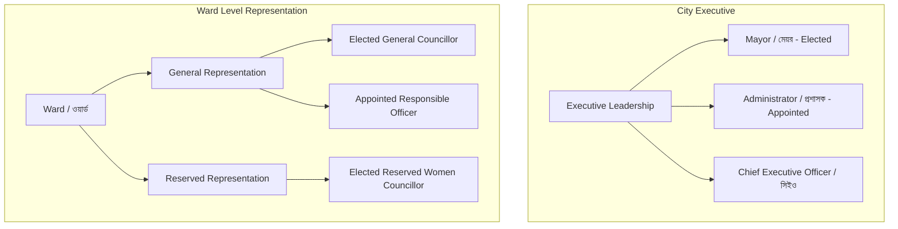

# City Governance & Representation Model

> **Document Status:** Authoritative Governance Specification  
> **Source of Truth:** [docs/MASTER_SPEC.md](file:///C:/laragon/www/amarmayor/docs/MASTER_SPEC.md) (Sections 63–112, 317–350, 399–416)

---

## 1. Governance Architecture Overview

Mymensingh City Corporation (MCC / ময়মনসিংহ সিটি কর্পোরেশন — মসিক) requires a flexible governance data model capable of representing both **elected local government administrations** and **government-appointed administrative tenures** without requiring structural code alterations.



---

## 2. City Executive Roles

### 2.1 Mayor (মেয়র)
* **Basis of Authority:** Democratically elected head of City Corporation.
* **Public Identification:** Explicitly titled "Mayor / মাননীয় মেয়র" on public portals and official profiles.
* **Oversight Scope:** Citywide monitoring, 6 top KPIs, Executive Command Center, *Attention Required* queues, binding executive directives.

### 2.2 Administrator (প্রশাসক)
* **Basis of Authority:** Appointed by Local Government Division (Ministry of LGRD) during interim governance periods.
* **Public Identification:** Explicitly titled "Administrator / প্রশাসক" across all public portals.
* **Oversight Scope:** Citywide executive oversight, executive directives, identical administrative authority with separate legal designation.

### 2.3 Chief Executive Officer / CEO (প্রধান নির্বাহী কর্মকর্তা)
* **Basis of Authority:** Senior civil servant (Joint Secretary / Deputy Secretary) heading permanent administrative and operational apparatus.
* **Oversight Scope:** Citywide inter-departmental coordination, workforce deployment, administrative appeals, and operational supervision.

---

## 3. Ward Representation Model

Mymensingh City Corporation consists of **33 General Wards** and **11 Reserved Seats for Women**.

### 3.1 General Ward Representation
Every General Ward has exactly one active General Representative at any point in time:
1. **Elected General Councillor (সাধারণ ওয়ার্ড কাউন্সিলর):** When municipal elections are active.
2. **Appointed Responsible Officer (দায়িত্বপ্রাপ্ত কর্মকর্তা):** Designated MCC or government officer when a Ward seat is vacant or under administrative transition.
   * A single Responsible Officer may legitimately be assigned to **one or multiple Wards** (e.g., covering Ward 05 and Ward 06).
   * The system links the officer's single login account to all assigned Wards without duplicating profiles.

### 3.2 Reserved Women Councillors (সংরক্ষিত নারী কাউন্সিলর)
* Each Reserved Seat covers a defined cluster of **three General Wards**:
  * **Reserved Seat 01:** Wards 01, 02, 03
  * **Reserved Seat 02:** Wards 04, 05, 06
  * **Reserved Seat 03:** Wards 07, 08, 09
  * **Reserved Seat 04:** Wards 10, 11, 12
  * **Reserved Seat 05:** Wards 13, 14, 15
  * **Reserved Seat 06:** Wards 16, 17, 18
  * **Reserved Seat 07:** Wards 19, 20, 21
  * **Reserved Seat 08:** Wards 22, 23, 24
  * **Reserved Seat 09:** Wards 25, 26, 27
  * **Reserved Seat 10:** Wards 28, 29, 30
  * **Reserved Seat 11:** Wards 31, 32, 33
* The Reserved Women Councillor logs in with a **single account** and automatically receives oversight access across all three covered Wards.

### 3.3 Dual Representation on Public Ward Profiles
Every public Ward page (`/ward/{ward_number}`) prominently displays **both** active representatives:
1. **General Representative:** Elected Councillor or Assigned Responsible Officer.
2. **Reserved Representative:** Reserved Women Councillor for the corresponding cluster.

---

## 4. Effective-Dated Governance Tenure & History

All governance positions utilize `representation_assignments` with explicit temporal bounds:

```sql
SELECT p.full_name_bn, rt.name_bn, ra.authority_basis, ra.effective_from, ra.effective_to
FROM representation_assignments ra
JOIN persons p ON ra.person_id = p.id
JOIN representation_types rt ON ra.representation_type_id = rt.id
WHERE ra.status = 'active'
  AND ra.effective_from <= NOW()
  AND (ra.effective_to IS NULL OR ra.effective_to >= NOW());
```

### Transition Integrity:
* When an election occurs or an appointment changes, the outgoing record receives an `effective_to = NOW()` and `status = 'term_ended'`.
* A new record is created with `effective_from = NOW()`.
* **Historical complaints preserve the exact representative who was active on the date of submission.**

---

## 5. Separation of Representative Oversight vs Field Operations
* **Advocacy & Oversight:** Councillors and Responsible Officers have access to view private complaints in their Wards, follow up progress, send structured communications, and request departmental support.
* **No Field Tampering:** Councillors and Responsible Officers **cannot** mark field tasks complete, upload final resolution verification, or overwrite technical supervisor findings. Operational integrity remains with the accountable service unit.
