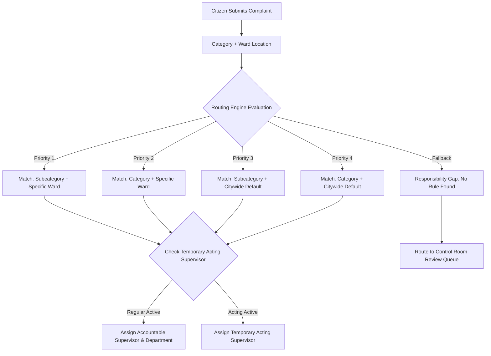

# Automatic Deterministic Routing Model

> **Document Status:** Authoritative Routing Engine Specification  
> **Source of Truth:** [docs/MASTER_SPEC.md](file:///C:/laragon/www/amarmayor/docs/MASTER_SPEC.md) (Sections 188–205, 357–358, 680)

---

## 1. Routing Engine Architecture

The platform uses a **deterministic, rule-based routing engine**.
* Citizens never choose departments, officers, or SLA rules.
* Complaints are automatically dispatched to the responsible department, service unit, supervisor, and field team based on verified operational rules.



---

## 2. Multi-Tier Resolution Hierarchy

When a complaint is submitted, the routing engine evaluates `routing_rules` using the following strict precedence:

1. **Tier 1 (Most Specific):** `subcategory_id` match **AND** `ward_id` match.
2. **Tier 2:** `category_id` match **AND** `ward_id` match.
3. **Tier 3:** `subcategory_id` match **AND** `ward_id IS NULL` (Citywide subcategory default).
4. **Tier 4 (Broadest Rule):** `category_id` match **AND** `ward_id IS NULL` (Citywide category default).
5. **Fallback:** If no active rule matches, the status transitions to `review_required`, and the complaint is placed into the **Control Room Review Queue**.

---

## 3. Temporary Responsibility & Acting Officer Overrides

When an assigned Supervisor is on leave or temporarily reassigned, the routing engine automatically checks for active temporary assignments in `employee_responsibilities`:

```sql
SELECT er.employee_id AS acting_supervisor_id
FROM employee_responsibilities er
WHERE er.service_unit_id = :service_unit_id
  AND er.area_type = 'ward'
  AND er.area_id = :ward_id
  AND er.effective_from <= NOW()
  AND (er.effective_to IS NULL OR er.effective_to >= NOW())
LIMIT 1;
```

* If an active temporary assignment exists, the complaint routes directly to the **Acting Supervisor**.
* When the temporary date range expires, routing automatically reverts to the permanent supervisor without manual database edits.

---

## 4. Responsibility Gap Detection & Guided Resolution

If an incoming complaint cannot be routed (e.g., a newly created civic category has no assigned department, or a Ward supervisor position is vacant), the platform triggers an automatic **Responsibility Gap**:

1. **Operational Safety:** Complaint enters `review_required` state; citizen receives confirmation that their issue is under review.
2. **Platform Super Admin Alert:** The Admin dashboard displays a prominent banner:
   > ⚠️ **দায়িত্ব বিভ্রাট চিহ্নিত (Responsibility Gap Detected):**  
   > *Ward 19 — মশক নিধন (Mosquito Control) শাখার কোনো সুপারভাইজার নির্ধারিত নেই।*
3. **Guided 2-Click Resolution Wizard:** Platform Super Admin clicks "Assign Responsibility" to select the responsible employee and service unit. The pending complaint is immediately rerouted.

---

## 5. Departmental Ownership Transfer Protocol

If field inspection reveals that a complaint belongs to a different department (e.g., a road pothole was caused by a collapsed drainage pipe under the Engineering department):

1. **Initiation:** The current Supervisor or Department Head selects **"Transfer Department"**, specifies the target Department / Unit, and provides a clear transfer note.
2. **Audit Logging:** An immutable record is created in `complaint_ownership_history`:
   * `from_department_id`, `to_department_id`, `from_supervisor_employee_id`, `to_supervisor_employee_id`, `transfer_reason`, `transferred_by_user_id`.
3. **Target Routing:** The routing engine resolves the responsible supervisor in the destination department and notifies them immediately.
4. **Citizen Transparency:** The citizen timeline updates to show: *"Transferred to Engineering Department for drainage inspection"*.
