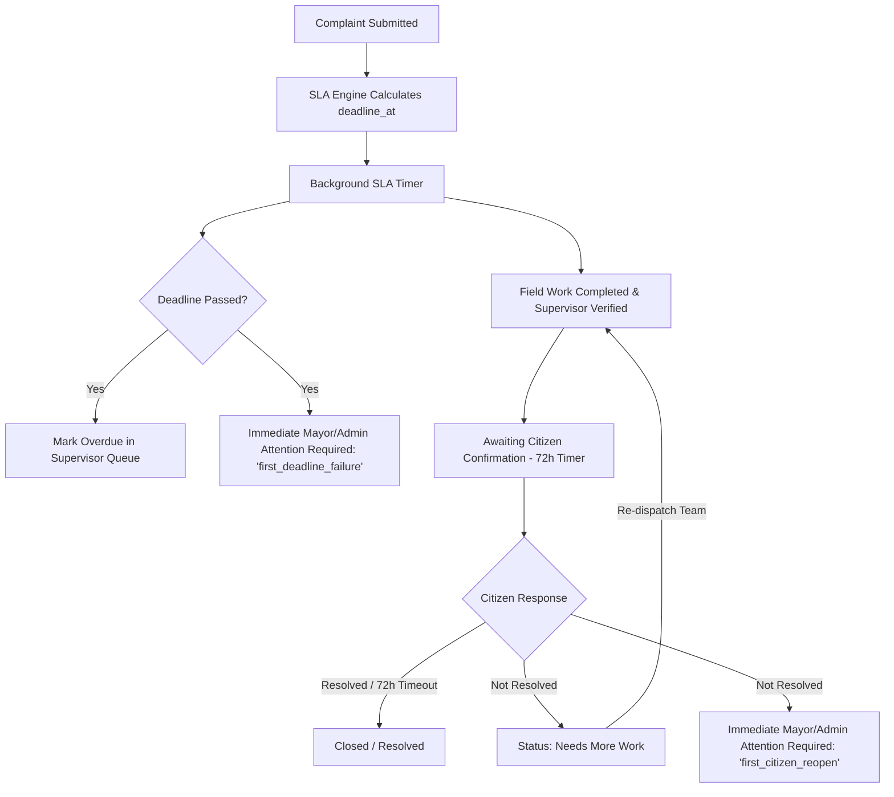

# Service SLA, Overdue & Reopen Architecture Model

> **Document Status:** Authoritative SLA & Executive Oversight Specification  
> **Source of Truth:** [docs/MASTER_SPEC.md](file:///C:/laragon/www/amarmayor/docs/MASTER_SPEC.md) (Sections 206–243, 317–338, 633–635, 683, 712–713)

---

## 1. Core SLA Philosophy

1. **Deterministic Deadlines:** Service timeframes are configured transparently per category, subcategory, and priority.
2. **Immediate Executive Visibility:** Bureaucratic multi-level escalation ladders (Level 1 $\rightarrow$ Level 2 $\rightarrow$ Level 3 $\rightarrow$ Level 4) are **strictly forbidden**.
   * **First Missed Deadline** $\longrightarrow$ Immediately visible in Mayor / Administrator *Attention Required*.
   * **First Citizen "Not Resolved"** $\longrightarrow$ Immediately visible in Mayor / Administrator *Attention Required*.
3. **Operational Ownership Preservation:** Executive attention provides high-level oversight and supportive intervention; it does **not** strip operational accountability from the assigned supervisor.
4. **Anti-Gaming Rule:** Case age and original deadline performance **never reset** on reopen.



---

## 2. Configurable Service Deadline Rules

Service SLAs are configured in `service_deadline_rules` based on category, subcategory, priority, and classification:

| Category / Service Subcategory | Default Classification | Priority | Default Expected Service Hours |
|---|---|---|---|
| **Urgent Civic Hazard (জরুরি বিপদ)** | `quick_action` | `p1_critical` | **4 Hours** |
| **Garbage Pile Removal (ময়লার স্তূপ অপসারণ)** | `quick_action` | `p2_high` | **8 Hours** |
| **Dead Animal Removal (মৃত পশুর মরদেহ অপসারণ)**| `quick_action` | `p1_critical` | **4 Hours** |
| **Mosquito Fogging (মশক নিধন)** | `quick_action` | `p3_normal` | **24 Hours** |
| **Drain Cleaning (ড্রেন পরিষ্কার)** | `quick_action` | `p3_normal` | **24 Hours** |
| **Street Light Repair (রাস্তার বাতি মেরামত)** | `maintenance` | `p3_normal` | **48 Hours** |
| **Water Supply Leakage (পানির পাইপ লিকেজ)** | `quick_action` | `p2_high` | **12 Hours** |
| **Road Pothole Patching (রাস্তার গর্ত মেরামত)** | `maintenance` | `p3_normal` | **72 Hours** |
| **Illegal Encroachment (অবৈধ দখল)** | `administrative_service`| `p3_normal` | **120 Hours (5 Days)** |

$$\text{deadline\_at} = \text{submitted\_at} + \text{expected\_hours}$$

---

## 3. Deadline Failure & Overdue Processing

1. **Detection:** A lightweight background job (`CheckDeadlinesJob`) runs on a scheduled cadence (every 5 minutes):
   ```sql
   SELECT id, public_complaint_number, ward_id, department_id, current_supervisor_employee_id, deadline_at
   FROM complaints
   WHERE internal_status IN ('submitted', 'routed', 'assigned', 'in_progress', 'needs_more_work')
     AND deadline_at < NOW()
     AND deadline_missed_at IS NULL;
   ```
2. **First-Failure Action:**
   * Updates `complaints.deadline_missed_at = NOW()`.
   * Inserts record into `executive_attention`:
     * `complaint_id`, `trigger_type = 'first_deadline_failure'`, `severity = 'p2_high'`, `is_active = 1`.
   * Dispatches low-noise notification to the Mayor/Administrator and the responsible Department Head.
   * Displays prominent **"অতিক্রান্ত (Overdue)"** badge on Supervisor and Ward Officer dashboards.

---

## 4. Citizen Confirmation, Reopen & Resolution Quality

### 4.1 Verification & Confirmation Flow
1. **Supervisor Verification:** Once field workers submit "After" evidence, the Supervisor verifies work on-site or via photographic evidence and approves completion.
2. **Citizen Prompt:** The citizen receives an instant notification (SMS / Push / Web):
   > *আপনার অভিযোগ নং MCC-260826-01842 এর কাজ সম্পন্ন হয়েছে বলে জানানো হয়েছে। আপনি কি সন্তুষ্ট? [হ্যাঁ, সমাধান হয়েছে] / [না, সমস্যা রয়েছে]*
3. **72-Hour Auto-Close:** If the citizen does not respond within 72 hours, the system auto-closes the complaint with `citizen_feedback.resolution_confirmation = 'auto_closed_no_response'` and sets `closed_at = NOW()`.

### 4.2 Reopen & "Needs More Work" Handling
If the citizen clicks **"Not Resolved / না, সমস্যা রয়েছে"**:
1. **Status Update:** `complaints.internal_status` transitions to `needs_more_work`, and `citizen_status` becomes `needs_more_work`.
2. **Reopen Tracking:** `reopen_count` is incremented (`reopen_count = reopen_count + 1`).
3. **First Reopen Attention:** If `reopen_count == 1`:
   * System records `complaints.first_reopened_at = NOW()`.
   * Creates `executive_attention (trigger_type = 'first_citizen_reopen', severity = 'p2_high')`.
4. **Repeated Failure:** If `reopen_count >= 2`:
   * Severity upgrades to `p1_critical`.
   * Mayor/Admin dashboard highlights:
     > 🔴 **পুনরাবৃত্ত ব্যর্থতা (Repeated Failure):** Complaint has failed resolution multiple times.
5. **Operational Re-dispatch:** The complaint is returned to the active Supervisor queue with citizen feedback notes.
6. **Case Age Integrity:** Case age remains anchored to original `submitted_at`. It **never** resets to 0.
