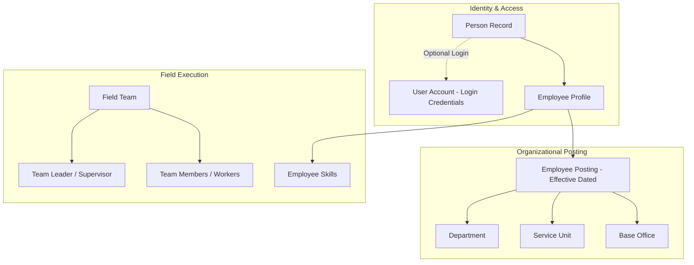

# Municipal Workforce & Operations Model

> **Document Status:** Authoritative Workforce Specification  
> **Source of Truth:** [docs/MASTER_SPEC.md](file:///C:/laragon/www/amarmayor/docs/MASTER_SPEC.md) (Sections 113–162, 351–363, 717)

---

## 1. Core Workforce Architecture

Mymensingh City Corporation operates a large workforce consisting of officers, engineers, inspectors, supervisors, drivers, field technicians, cleaners, and daily wage workers.

The workforce subsystem serves as the **operational master directory** for task routing, dispatch, team assignment, and accountability.



---

## 2. Decoupled Person, Employee, and User Account Model

To accurately reflect municipal reality, the platform strictly separates three concepts:

1. **`persons` (Human Identity):** Contains universal personal metadata (full name in Bangla/English, photo, contact information).
2. **`employees` (Workforce Record):** Contains official employment data (employee code e.g. `MCC-EMP-000421`, designation, employment type, reporting officer, duty status).
3. **`users` (System Login Account):** Authentication credentials (phone, password hash, role assignments, session tokens).

### Key Architectural Rules:
* **Login Not Required for Every Worker:** Many field cleaners and daily wage workers do not need smartphone logins. They exist as `employees` so their work can be assigned, tracked, and scheduled by Supervisors and Team Leaders.
* **Non-Destructive Access Revocation:** Disabling or removing a user account (`users.status = 'inactive'`) **never** deletes the employee profile, past task history, or audit logs.

---

## 3. Employment Classifications & Designations

The platform supports all official MCC employment types:
* `officer` (গেজেটেড / প্রথম-দ্বিতীয় শ্রেণির কর্মকর্তা)
* `permanent` (স্থায়ী কর্মচারী)
* `temporary` (অস্থায়ী / চুক্তিভিত্তিক কর্মচারী)
* `daily_wage` (মাস্টাররোল / দৈনিক মজুরিভিত্তিক কর্মী)
* `outsourced` (আউটসোর্সিং কর্মী)
* `cleaner` (পরিচ্ছন্নতাকর্মী)
* `field_worker` (মাঠকর্মী / মশক নিধন কর্মী)
* `driver` (গাড়ি চালক / ভারী যন্ত্র চালক)
* `supervisor` (সুপারভাইজার / পরিদর্শক)
* `technician` (কারিগর / বিদ্যুৎমিস্ত্রি)

---

## 4. Postings, Transfers & Effective Dating

Employee organizational assignments are managed through `employee_postings`:

```sql
SELECT e.employee_code, p.full_name_bn, d.name_bn AS department, su.name_bn AS unit, ep.posting_type
FROM employees e
JOIN persons p ON e.person_id = p.id
JOIN employee_postings ep ON e.id = ep.employee_id
JOIN departments d ON ep.department_id = d.id
LEFT JOIN service_units su ON ep.service_unit_id = su.id
WHERE ep.effective_from <= NOW()
  AND (ep.effective_to IS NULL OR ep.effective_to >= NOW());
```

* **Transfer Workflow:** Updating an employee's department, ward, or office automatically sets `effective_to` on the current posting and creates a new active posting.
* **Historical Integrity:** A transfer executed today does not corrupt complaint history resolved by the employee in their previous department last month.

---

## 5. Teams & Field Crew Structure

For high-volume operations (e.g., waste collection, drain cleaning, mosquito fogging), field workers are grouped into `teams`:
* **Team Attributes:** Name (`দল ১৯-ক`), Primary Ward (`Ward 19`), Department (`Waste Management`), Designated Supervisor (`Supervisor X`), and Team Leader (`Team Leader Y`).
* **Team Membership (`team_members`):** Effective-dated association of workers with field teams.
* **Dispatch:** Supervisors can dispatch a task directly to a **Team** or an individual **Worker**.

---

## 6. Duty Status & Operational Availability

Employees maintain an active `duty_status`:
* `available` (কাজে প্রস্তুত)
* `on_duty` (দায়িত্বরত)
* `busy` (কাজে ব্যস্ত)
* `on_leave` (ছুটিতে)
* `temporarily_reassigned` (সাময়িকভাবে অন্য দায়িত্বে)
* `off_duty` (ডিউটি শেষ)

When a Supervisor is placed `on_leave`, the platform prompts for a **Temporary Acting Supervisor** with defined start/end dates. The routing engine routes incoming complaints to the acting supervisor during this period without creating unassigned responsibility gaps.
